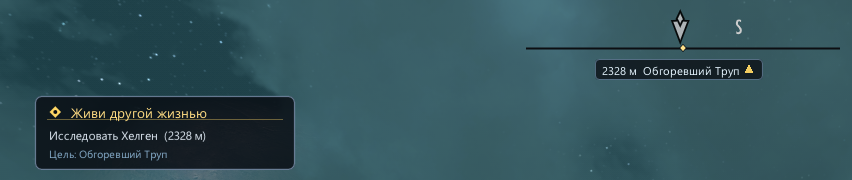
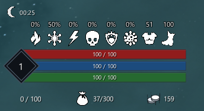

# PerfUI

[](LICENSE)
[](https://github.com/PerfLite/PerfUI/actions)
[](https://en.cppreference.com/w/cpp/20)
[](https://learn.microsoft.com/en-us/windows/win32/direct3d11/atoc-dx-graphics-direct3d-11)
[](https://skse.silverlock.org/)
[](https://github.com/ocornut/imgui)



<p align="center">
  
</p>

**PerfUI** is an independent, high-performance retained-mode C++20 user interface framework built specifically for *The Elder Scrolls V: Skyrim Special Edition / Anniversary Edition*, as well as standalone DirectX 11 applications.

It provides mod authors and game developers with an intuitive, modern object-oriented API for building complex, fluid, gamepad-friendly in-game menus, HUD overlays, journal windows, and configuration interfaces.

---

## 🌟 Acknowledgments & Third-Party Credits

PerfUI utilizes **[Dear ImGui](https://github.com/ocornut/imgui)** (created by [Omar Cornut](https://github.com/ocornut) and contributors) as its primary rendering backend foundation (`ImDrawList` vertex buffer pipeline).

* **[Dear ImGui GitHub Repository](https://github.com/ocornut/imgui)**
* **License:** Dear ImGui is licensed under the [MIT License](https://github.com/ocornut/imgui/blob/master/LICENSE.txt).

### The Decoupling Principle
While Dear ImGui powers low-level font rendering and 2D vector primitives, **PerfUI's public API never exposes `<imgui.h>`**. All client and widget code interacts exclusively with PerfUI's retained scene graph and the abstract `UIRenderBackend` interface. This allows future renderer backends (native D3D11, Vulkan, or D3D12) to be swapped in seamlessly without modifying a single line of client UI code.

---

## ⚡ Key Features

* **Retained-Mode Scene Graph:** Hierarchical DOM-like element tree (`UIElement`, `UIWindow`, `Panel`) with dirty-flag layout optimization.
* **Flexbox & Stack Layout Engine:** Automatic layout calculation, flex-grow/shrink, alignment, padding, margins, and auto-sizing.
* **Controller & Gamepad First:** Full focus-graph navigation supporting D-Pad, Thumbsticks, Keyboard, and Mouse with automatic spatial focus transitions.
* **Rich Modern Widget Library:**
  * Containers & Windows: `UIWindow`, `Panel`, `ScrollView`, `ModalDialog`, `ContextMenu`, `TabBar`
  * Controls: `Button`, `Checkbox`, `Slider`, `ComboBox`, `TextInput`, `ProgressBar`
  * Display: `Text`, `Image`, `Toast` notifications
* **Nordic Skyrim Styling & Aesthetics:** Built-in Skyrim-authentic themes (parchment, dark charcoal slate, gold and silver trim, runes, ambient glass depth).
* **Animation & State Engine:** Smooth easing functions, transitions, hover/active glow effects, and auto-fade mechanisms.
* **Cyrillic & Localization Ready:** Native UTF-8 string support with Cyrillic glyph range preloading (`GetGlyphRangesCyrillic`) and Windows system font fallback (Segoe UI / Arial / custom TTF).
* **Skyrim Game Services:** Bridge for playing native UI sound descriptors, querying quests/stats, and hooking into the DirectX 11 Present loop.
* **Declarative XML Markup & Instant Hot-Reload:** Separate lightweight static library (`PerfUI_Markup`) allowing authors to declare complex UIs in XML, bind C++ callbacks by name, and edit layouts live with instant state-preserving hot-reload. See [docs/MARKUP.md](docs/MARKUP.md).

---

## ⚡ Performance, Architecture & Benchmarks

### Dirty-Flag Layout Caching vs. Immediate-Mode Rendering
To provide extreme responsiveness without stutter, PerfUI uses a two-stage decoupled execution model:
1. **Layout Pass (Cached via Dirty Flags):**
   - Expensive geometry measurements (`LayoutEngine::Measure`) and box-model arrangements (`LayoutEngine::Arrange`) only run when a widget's geometry or contents actually change (via `markLayoutDirty()`).
   - When the widget tree is static, layout calculations are **100% skipped** (`isLayoutDirty() == false`), reducing CPU overhead to practically zero.
2. **Render Pass (Immediate-Mode Primitive Streaming):**
   - In each frame, `UIElement::render()` traverses the visible hierarchy and emits 2D vector commands to `UIRenderBackend` (mapping directly to `ImDrawList`).
   - This ensures 60 FPS / 144+ FPS animation smoothness, easing curves, and glow interpolations without the memory footprint or synchronization overhead of caching complex vertex buffers.

### Benchmark Data (550+ Active Retained Elements)
Measurements taken on Windows 11 x64 (MSVC 2022 v143, Release Build):

| Metric | 550+ Elements Hierarchy | Overhead / Note |
| :--- | :--- | :--- |
| **Cold Layout + Render** | **~0.21 ms** (208 µs) | Initial tree build and full measurement |
| **Layout Cache Pass (Dirty-Flag Hit)** | **~0.05 ms** (50 µs) | Layout calculation skipped via cache; pure draw command submission |
| **Full Tree Re-Layout** | **~0.11 ms** (109 µs) | Invalidation of root + flexbox re-arrangement |
| **Mock Draw Call Submission** | **1,042 draw calls in 0.04 ms** | Sub-microsecond per draw command |

*Impact on Game Frame Rate:* At 60 FPS (16.6 ms budget), a typical PerfUI menu with hundreds of interactive widgets takes **less than 0.3% of the frame budget**, guaranteeing zero framerate drops in Skyrim.

---

## 🏗️ Architecture

```text
┌────────────────────────────────────────────────────────────────────────┐
│                          Game / Mod Logic                              │
│              Custom HUD, Menus, Mod Configuration Overlays             │
└───────────────────────────────────┬────────────────────────────────────┘
                                    │
                                    ▼
┌────────────────────────────────────────────────────────────────────────┐
│                        PerfUI Public API Layer                         │
│   UIContext, UIWindow, Panel, Button, Text, ScrollView, Slider, etc.   │
└───────────────────────────────────┬────────────────────────────────────┘
                                    │
                                    ▼
┌────────────────────────────────────────────────────────────────────────┐
│                              PerfUI Core                               │
│  ├── Retained UI Tree (UIElement, Hierarchy, Memory Lifecycle)         │
│  ├── Layout Engine (Flex / Box Model / Anchoring)                     │
│  ├── Styling & Theme Engine (Brushes, Palettes, Metrics, Fonts)        │
│  ├── Animation Engine (Interpolation, Easing Curves)                   │
│  ├── Input & Focus Graph (Gamepad D-Pad, Mouse, Keyboard Capture)      │
│  └── Event System (Bubbling, Tunneling, Direct Callbacks)              │
└───────────────────────────────────┬────────────────────────────────────┘
                                    │
                                    ▼
┌────────────────────────────────────────────────────────────────────────┐
│                       UIRenderBackend Interface                        │
│   beginFrame(), drawRect(), drawRoundedRect(), drawText(), drawLine()  │
└───────────────────────────────────┬────────────────────────────────────┘
                                    │
                                    ▼
┌────────────────────────────────────────────────────────────────────────┐
│                 Backend Implementation (ImDrawList)                    │
│             [Dear ImGui](https://github.com/ocornut/imgui) (MIT)       │
│                                   │                                    │
│                                   ▼                                    │
│                         DirectX 11 Hardware                            │
└────────────────────────────────────────────────────────────────────────┘
```

---

## 🚀 Quick Start Example

Creating an interactive window with `UIWindow` and flexbox layout:

```cpp
#include <PerfUI/PerfUI.h>
#include <PerfUI/UIWindow.h>

void CreateMyCustomMenu(PerfUI::UIContext& context) {
    // 1. Create a top-level window with title bar and close button
    auto* window = context.root()->add<PerfUI::UIWindow>("My Mod Configuration");
    window->setBounds(PerfUI::Rect{ 100.0f, 100.0f, 480.0f, 340.0f });
    window->layout()
        .direction(PerfUI::LayoutDirection::Vertical)
        .padding(16.0f)
        .gap(12.0f);

    // 2. Add description text
    auto* desc = window->add<PerfUI::Text>("Retained-mode modern UI for Skyrim modders.");
    desc->color(PerfUI::Color(220, 225, 235)).fontSize(12.0f);

    // 3. Add Interactive Controls
    auto* slider = window->add<PerfUI::Slider>(50.0f, 0.0f, 100.0f);
    slider->onValueChanged([](float val) {
        // Handle value change
    });

    auto* checkbox = window->add<PerfUI::Checkbox>("Enable Dynamic Status HUD", true);
    checkbox->onToggle([](bool enabled) {
        // Toggle feature
    });

    auto* button = window->add<PerfUI::Button>("Save & Apply Settings");
    button->onClick([window]() {
        window->close();
    });
}
```

---

## 📂 Repository Structure

```text
PerfUI/
├── include/PerfUI/         # Public header files (No ImGui headers exposed!)
│   ├── Animation.h         # Tweening & easing helpers
│   ├── Button.h            # Button widget
│   ├── Checkbox.h          # Checkbox widget
│   ├── ComboBox.h          # Dropdown combo box widget
│   ├── ContextMenu.h       # Popup context menu
│   ├── ModalDialog.h       # Modal dialog window
│   ├── Panel.h             # Flexible container panel
│   ├── ProgressBar.h       # Progress bar widget
│   ├── ScrollView.h        # Scrollable container view
│   ├── Slider.h            # Numeric slider control
│   ├── TabBar.h            # Tab navigation widget
│   ├── Text.h              # Text display widget
│   ├── TextInput.h         # Text input box
│   ├── Theme.h             # Colors, metrics, and themes
│   ├── Toast.h             # Pop-up toast notifications
│   ├── UIContext.h         # Root framework context
│   ├── UIElement.h         # Base retained element
│   └── UIWindow.h          # Top-level window with titlebar & close button
├── src/                    # Implementation files
│   ├── backends/           # Render backends (ImGui, Mock headless backend)
│   ├── core/               # Core runtime, context, memory lifecycle
│   ├── layout/             # Flexbox and box-model layout engine
│   ├── skyrim/             # DirectX 11 hook, SKSE plugin, audio bridge
│   └── widgets/            # Widget implementations
├── tests/                  # Automated unit test suite
│   ├── BackendIndependenceTest.cpp # Proof of 100% backend independence
│   └── LayoutTest.cpp      # Flex-grow, padding, auto-size & 500-widget benchmark
├── examples/               # Sample implementations for modders
│   ├── modder_custom_hud/  # Custom HUD widget example
│   ├── modder_menu_plugin/ # Interactive SKSE mod menu window example
│   └── sandbox/            # Standalone Win32/D3D11 desktop sandbox
├── third_party/
│   └── imgui/              # Dear ImGui library (Omar Cornut - MIT License)
├── docs/                   # Documentation and assets
├── CMakeLists.txt          # CMake build configuration
├── xmake.lua               # XMake build script
├── LICENSE                 # MIT License
└── README.md               # Project documentation
```

---

## 🛠️ Build & Testing

* **OS:** Windows 10 / 11 (64-bit), Linux (Core & Tests)
* **Compiler:** Microsoft Visual C++ (MSVC) 2022 v143+, GCC 12+, Clang 15+ with C++20 support (`/std:c++20` / `-std=c++20`)
* **Build System:** [XMake](https://xmake.io/) (Recommended) or [CMake](https://cmake.org/) (3.20+)
* **Dependencies:** DirectX 11 SDK (included with Windows SDK for Skyrim plugin and Win32 sandbox; Core & Tests are dependency-free)

### Building with XMake (Fastest)

```powershell
# Clone the repository
git clone https://github.com/PerfLite/PerfUI.git
cd PerfUI

# Build & run layout and focus test suite + benchmark
xmake run PerfUI_Test_Layout

# Build & run backend independence test
xmake run PerfUI_Test_Independence
```

### Building with CMake

```powershell
cmake -B build -S . -DCMAKE_BUILD_TYPE=Release
cmake --build build --config Release --target PerfUI_Test_Layout PerfUI_Test_Independence

# Run tests
ctest --test-dir build -C Release --output-on-failure
```

---

## 📚 Documentation & Guides

* **Modder Integration Guide:** [English](docs/MODDER_GUIDE_EN.md) | [Русский](docs/MODDER_GUIDE.md)
* **Declarative XML Markup & Hot-Reload:** [English](docs/MARKUP_EN.md) | [Русский](docs/MARKUP.md)
* **Skyrim Input, Mouse & Cursor Integration:** [English](docs/SKYRIM_INPUT_GUIDE_EN.md) | [Русский](docs/SKYRIM_INPUT_GUIDE.md)
* **Core Architecture Overview:** [ARCHITECTURE.md](ARCHITECTURE.md)
* **Visual & Widget Design Specification:** [DESIGN.md](DESIGN.md)

---

## 🇷🇺 Описание проекта (Russian Overview)

**PerfUI** — это независимый, высокопроизводительный retained-mode UI-фреймворк на современном стандарте **C++20**, разработанный специально для создания модификаций и интерфейсов для игры *The Elder Scrolls V: Skyrim Special Edition / Anniversary Edition*, а также для автономных графических приложений на DirectX 11.

Фреймворк предоставляет авторам модов и разработчикам удобный объектно-ориентированный C++ API для построения плавных, отзывчивых и удобных для управления с геймпада внутриигровых меню: журналов заданий, кастомных HUD-полосок, экранов настроек, диалоговых окон и окон конфигурации модов.

### 🌟 Ключевые особенности

* **Дерево элементов (Retained-Mode):** Иерархический граф сцены (`UIElement`, `UIWindow`, `Panel`) с dirty-флагами — вычисления геометрии и Flexbox происходят только при фактических изменениях.
* **Движок вёрстки (Flexbox & Box-Model):** Автоматическое распределение элементов, гибкие направления (`Row` / `Column`), адаптивное растяжение (`flex-grow`), отступы (`padding`, `margin`) и авто-размеры (`Auto`).
* **Адаптация под геймпады (Controller-First):** Полноценная навигация по графу фокуса с помощью крестовины (D-Pad), стиков, клавиатуры и мыши с автоматическим пространственным переходом фокуса.
* **Библиотека готовых виджетов:**
  * **Окна и контейнеры:** `UIWindow` (окна с заголовком и кнопкой закрытия), `Panel` (панели), `ScrollView` (области прокрутки), `ModalDialog` (модальные диалоги), `ContextMenu` (всплывающие контекстные меню), `TabBar` (вкладки).
  * **Элементы управления:** `Button` (кнопки), `Checkbox` (флажки), `Slider` (ползунки), `ComboBox` (выпадающие списки), `TextInput` (ввод текста), `ProgressBar` (полосы прогресса).
  * **Информационные виджеты:** `Text` (форматированный текст), `Image` (текстуры/картинки), `Toast` (всплывающие уведомления).
* **Стилизация в эстетике Скайрима:** Встроенные темы оформления (тёмный сланец, пергамент, золото, серебряные окантовки, нордические орнаменты) и движок анимаций (плавное появление, пульсация, hover-эффекты).
* **Поддержка кириллицы:** Встроенная загрузка диапазонов кириллических глифов ImGui и системных шрифтов Windows (Segoe UI, Arial).
* **Изоляция бэкенда:** Проект использует библиотеку [Dear ImGui](https://github.com/ocornut/imgui) **исключительно** как начальный фундамент растеризации вершинных буферов (`ImDrawList`). Внешний API `PerfUI` полностью независим и не подключает заголовочные файлы ImGui, что позволяет в будущем бесшовно заменить бэкенд на прямой D3D11/D3D12/Vulkan без переписывания пользовательского кода интерфейсов.

---

## 🔥 Рисуй интерфейс без перекомпиляции (XML Markup & Hot-Reload)

С новой библиотекой **`PerfUI_Markup`** интерфейсы описываются в декларативном XML без необходимости пересобирать плагин или перезапускать игру:

```xml
<UI>
  <Panel name="Settings" direction="column" width="420" padding="20" gap="10" bg="$surfaceElevated">
    <Text text="Настройки мода" font="title" color="$nordicGold"/>
    <Slider name="Volume" label="Громкость" min="0" max="100" value="80"/>
    <Checkbox name="EnableCompass" label="Показывать расширенный компас" checked="true"/>
    <Panel direction="row" gap="8" justify="end">
      <Button text="Отмена" onClick="cancelAction"/>
      <Button text="Сохранить" onClick="saveAction" class="primary"/>
    </Panel>
  </Panel>
</UI>
```

```cpp
#include <PerfUI/Markup/MarkupLoader.h>

PerfUI::MarkupLoader loader(context);
loader.bindCallback("cancelAction", [&]() { /* ... */ });
loader.bindCallback("saveAction", [&]() { /* ... */ });

loader.enableHotReload(true);
loader.loadFile("Data/Interface/PerfUI/settings.xml");

// В каждом кадре:
loader.poll(); // Автоматически перезагрузит изменённый XML!
```

* **Мгновенный отклик:** файл опрашивается каждые ~500 мс без блокировок и фоновых потоков.
* **Сохранение состояния:** при перезагрузке автоматически сохраняется фокус ввода, позиция скролла (`ScrollView`) и выбранные вкладки (`TabBar`).
* **Устойчивость к ошибкам:** при битом XML предыдущее рабочее дерево не ломается, а на экран выводится детальный Toast с номером строки ошибки.
* **Подробное руководство:** см. [docs/MARKUP.md](docs/MARKUP.md).

---

## 📜 License

This project is licensed under the **MIT License**.  
See the [LICENSE](LICENSE) file for the full text.

### Third-Party Licenses

* **[Dear ImGui](https://github.com/ocornut/imgui)**  
  Copyright (c) 2014-2026 Omar Cornut.  
  Licensed under the [MIT License](https://github.com/ocornut/imgui/blob/master/LICENSE.txt).
* **[CommonLibSSE-ng](https://github.com/CharmedBaryon/CommonLibSSE-ng)**  
  Licensed under the [MIT License](https://github.com/CharmedBaryon/CommonLibSSE-ng/blob/main/LICENSE).
