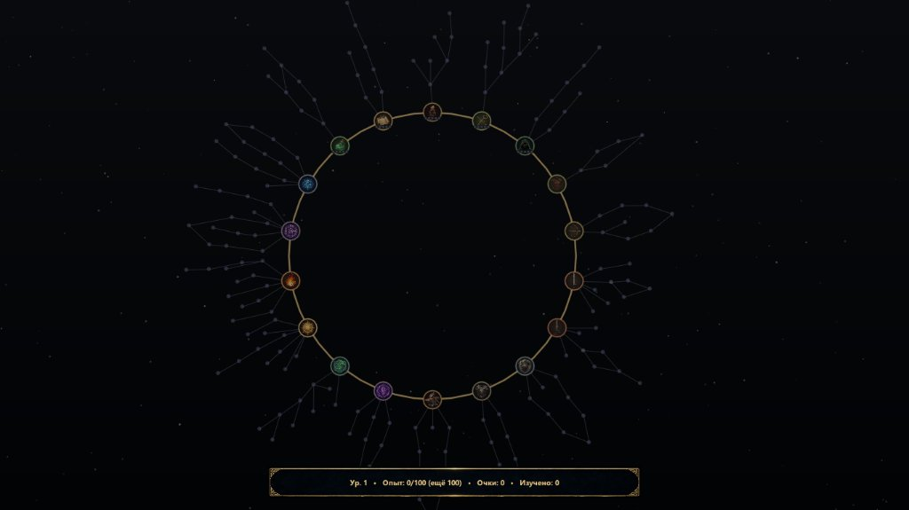
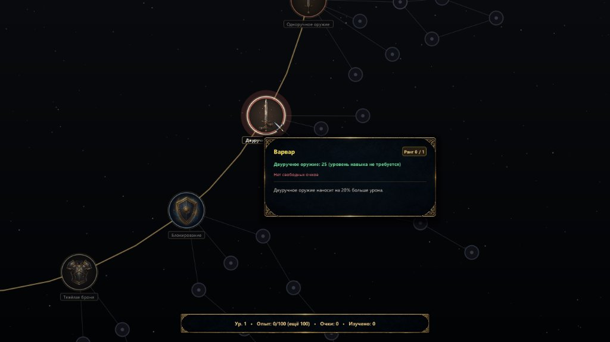
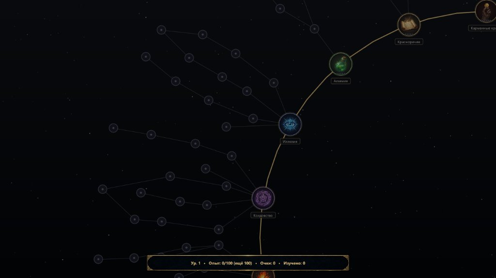
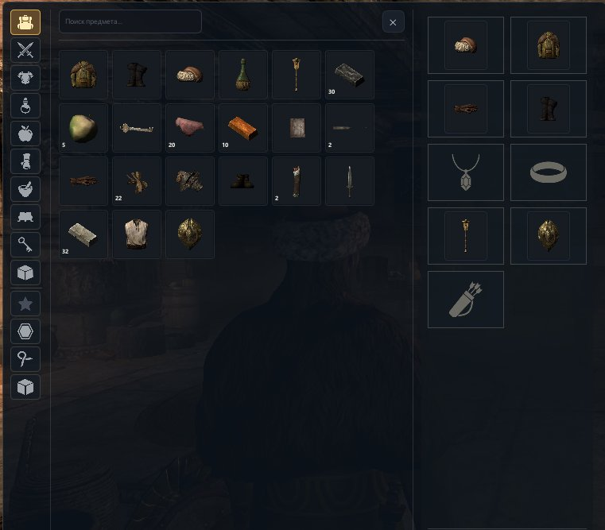

<div align="center">



<p>
  <a href="#english">🇬🇧 English</a> ·
  <a href="#русский">🇷🇺 Русский</a>
</p>

<p>
  
  
  
  
  
  
</p>

<p>
  <a href="https://perflite.github.io/PerfUI/"><b>🌐 Official Website / Официальный сайт</b></a> ·
  <a href="https://github.com/PerfLite/PerfUI/releases/latest"><b>⬇️ Download / Скачать</b></a> ·
  <a href="https://github.com/PerfLite/PerfUI/releases">📦 All releases / Все релизы</a>
</p>

</div>

## ⬇️ Download / Скачать

| File / Файл | Description / Описание | Link / Ссылка |
|---|---|---|
| `PerfUI-SKSE.zip` | Skyrim SE / AE Plugin & Assets · Плагин для Skyrim SE/AE | [Download](https://github.com/PerfLite/PerfUI/releases/latest/download/PerfUI-SKSE.zip) |
| `PerfUI-SDK.zip` | C++20 Headers, Libs & XML Markup Tools for Modders · SDK для разработчиков модов | [Download](https://github.com/PerfLite/PerfUI/releases/latest/download/PerfUI-SDK.zip) |

> Older versions and changelogs: [Releases](https://github.com/PerfLite/PerfUI/releases) ·  
> Старые версии и список изменений: [Релизы](https://github.com/PerfLite/PerfUI/releases)

---

## English

> 🌐 **Official Website & Interactive Showcase:** [https://perflite.github.io/PerfUI/](https://perflite.github.io/PerfUI/)

High-performance, retained-mode C++20 UI framework for *The Elder Scrolls V: Skyrim Special Edition / Anniversary Edition* and standalone DirectX 11 applications.

<p align="center">
  
  
  
  
</p>

### Features

- ⚡ **Retained-Mode Scene Graph:** Hierarchical DOM-like element tree (`UIElement`, `UIWindow`, `Panel`) with dirty-flag layout optimization (<0.2 ms per frame for 550+ active elements).
- 📐 **Flexbox & Stack Layout Engine:** Directional layouts (`Row` / `Column`), automatic flex-grow/shrink, alignment, padding, margins, and auto-sizing.
- 🎨 **PerfUI Style Sheets (PSS) & Declarative CSS Cascading:** Standalone, lightweight CSS-subset stylesheet engine (`.pss`) with element, class (`.card`), ID (`#submit`), child (`>`), descendant, and compound selectors. Features `:root` CSS custom variables (`var(--accent)`) with live runtime theme switching, state pseudo-classes (`:hover`, `:active`, `:focus`, `:disabled`, `:checked`, `:first-child`, `:last-child`), and lazy subtree cascade recalculation (<0.12 ms).
- 🎬 **Smooth CSS Transitions & Physics Animation Engine:** Declarative `transition` declarations (`background 0.2s ease, opacity 0.15s linear, transform-scale 0.3s cubic-bezier(...)`) with seamless mid-transition reversal from current visual values. Complemented by C++ RK4 physics springs (`ElementSpring` with `Gentle`, `Snappy`, `Wobbly` presets), multi-track timelines (`Timeline` with `sequence`, `parallel`, `stagger`), and accessibility reduced-motion support.
- ✨ **Hardware Kawase Dual-Filter Blur Pass (PostFX):** Real-time DirectX 11 frosted glass background blur pass (`D3D11BlurPass`) delivering modern aero/frosted aesthetic behind dialogs, HUD cards, and full-screen windows without CPU overhead.
- 📐 **Visual Transform Layer:** GPU-accelerated 2D visual transforms (`transform-scale`, `transform-offset` in `px` and `%`, `transform-pivot`) and blend modes (`additive`, `multiply`, `screen`) applied directly at rasterization time without triggering flexbox layout reflow.
- 🎮 **Controller & Gamepad First:** Full 2D focus-graph navigation supporting D-Pad, Thumbsticks, Keyboard, and Mouse with automatic spatial focus transitions.
- 🗡️ **Authentic Nordic Sword Cursor:** Global hardware-accurate Skyrim sword cursor rendered in foreground draw list with soft drop shadows; hooks `CursorMenu` with zero Flash null-pointer dereferences or disappearance glitches.
- 🎨 **Native Vector SVG Graphics:** Embedded NanoSVG parser and rasterizer (`SvgImage` widget, `SvgService`) delivering crisp vector icons at any resolution without Chromium/CEF overhead.
- 🧩 **Comprehensive Modern Widget Library:**
  - **Containers & Windows:** `UIWindow`, `Panel`, `ScrollView`, `ModalDialog`, `ContextMenu`, `TabBar`, `Accordion`, `Sidebar`, `CategoryList`.
  - **Controls:** `Button`, `Checkbox`, `Slider`, `ComboBox`, `TextInput`, `ProgressBar`, `Switch`, `RadioButton`, `RadioGroup`, `KeybindSelector`, `SegmentedControl`.
  - **Data & Display:** `Text`, `TextArea`, `Image`, `SvgImage`, `Toast`, `Notification`, `ItemSlot`, `SearchableList`, `QuestTracker`, `MapCanvas` (radar & world modes), `Divider`, `Spacer`.
- 🎭 **Theme Tokens & Design System:** Built-in design tokens with 4 visual presets: `SkyrimClassic`, `NordicDark`, `GlassFrost`, `WarmParchment`.
- 🌐 **Cyrillic & Symbol Typography:** Native UTF-8 string support with Cyrillic glyph preloading and merged Segoe UI Symbol font for quest diamond markers, dingbats, and geometric symbols.
- 🌍 **Native Multi-Language Localization:** Built-in dictionary translation engine with runtime language switching, parameter interpolation, and declarative XML/Lua string token bindings (`$token`, `ui.tr`).
- 🔄 **Declarative XML Markup & Instant Hot-Reload:** Static library (`PerfUI_Markup`) allowing authors to declare UIs in XML and edit layouts live with instant state-preserving hot-reload without restarting the game.
- 📜 **Lua 5.4 Scripting & Data-Driven Logic:** Embedded sandboxed Lua runtime (`PerfUI_Lua`) enabling zero-C++ mod development via `<UI script="main.lua">`, safe element handles, timers (`ui.timer`, `ui.interval`), toasts, and per-call instruction/memory limits.
- 🖥️ **Standalone DirectX 11 Desktop Sandbox:** Instantaneous development, testing, and hot-reload of XML layouts and PSS stylesheets in a lightweight native desktop host (`PerfUI_Sandbox.exe`) without needing to launch Skyrim.
- 📊 **Built-in Diagnostics & Fault Guard:** `F7` performance panel (frame pacing, UI cost, draw calls, per-overlay timings), automatic hitch log next to the DLL, live SVG/PNG asset reload, and an SEH watchdog that disables a crashing overlay instead of taking the game down.
- 🛡️ **Complete Backend Decoupling:** Dear ImGui is used strictly as an internal rasterization foundation (`ImDrawList`). The public API never exposes `<imgui.h>`, enabling future backend swaps (native D3D11, Vulkan, D3D12) with zero client code changes.

### Install

#### For Players & Mod Users:
1. Download `PerfUI-SKSE.zip` from [Releases](https://github.com/PerfLite/PerfUI/releases/latest).
2. Install via Mod Organizer 2 or Vortex.
3. Requires: Skyrim SE 1.5.97 or AE 1.6+, SKSE64, Address Library for SKSE Plugins.

#### For Mod Developers:
Include the repository as a submodule or link the SDK:

```
https://github.com/PerfLite/PerfUI
```

Include headers and link against `PerfUI.lib`:
```cpp
#include <PerfUI/PerfUI.h>
#include <PerfUI/UIWindow.h>
```

### Build

* **Compiler:** MSVC 2022 v143+ (C++20 `/std:c++20`), GCC 12+, Clang 15+
* **Build System:** [XMake](https://xmake.io/) (Recommended) or [CMake](https://cmake.org/) (3.20+)

#### Using XMake:

```powershell
git clone https://github.com/PerfLite/PerfUI.git
cd PerfUI
xmake build PerfUI
xmake run PerfUI_Test_Layout
xmake run PerfUI_Test_Independence
```

#### Using CMake:

```powershell
cmake -B build -S . -DCMAKE_BUILD_TYPE=Release
cmake --build build --config Release
ctest --test-dir build -C Release --output-on-failure
```

### Documentation

* **Modder Integration Guide:** [English](docs/MODDER_GUIDE_EN.md) | [Русский](docs/MODDER_GUIDE.md)
* **Declarative XML Markup & Hot-Reload:** [English](docs/MARKUP_EN.md) | [Русский](docs/MARKUP.md)
* **PerfUI Style Sheets (PSS) & Transitions:** [English](docs/PSS_EN.md) | [Русский](docs/pss.md)
* **Lua 5.4 Scripting Engine:** [English](docs/LUA_EN.md) | [Русский](docs/LUA.md)
* **Skyrim Input & Cursor Integration:** [English](docs/SKYRIM_INPUT_GUIDE_EN.md) | [Русский](docs/SKYRIM_INPUT_GUIDE.md)
* **MapCanvas Radar & World Widget:** [English](docs/MAPCANVAS_EN.md) | [Русский](docs/MAPCANVAS.md)
* **Architecture Overview:** [ARCHITECTURE.md](ARCHITECTURE.md)

### License

Licensed under the **MIT License** — see [LICENSE](LICENSE).

#### Third-Party Credits:
* **[Dear ImGui](https://github.com/ocornut/imgui)** (Omar Cornut) — [MIT](https://github.com/ocornut/imgui/blob/master/LICENSE.txt)
* **[NanoSVG](https://github.com/memononen/nanosvg)** (Mikko Mononen) — [zlib](https://github.com/memononen/nanosvg/blob/master/LICENSE.txt)
* **[pugixml](https://github.com/zeux/pugixml)** (Arseny Kapoulkine) — [MIT](https://github.com/zeux/pugixml/blob/master/LICENSE.md)
* **[stb](https://github.com/nothings/stb)** (Sean Barrett) — [MIT / Public Domain](https://github.com/nothings/stb/blob/master/LICENSE)
* **[CommonLibSSE-ng](https://github.com/CharmedBaryon/CommonLibSSE-ng)** — [MIT](https://github.com/CharmedBaryon/CommonLibSSE-ng/blob/main/LICENSE)

<p align="right"><a href="#english">↑ Back to top</a> · <a href="#русский">Русский ↓</a></p>

---

## Русский

> 🌐 **Официальный сайт и интерактивная демонстрация:** [https://perflite.github.io/PerfUI/](https://perflite.github.io/PerfUI/)

Высокопроизводительный retained-mode C++20 UI-фреймворк для *The Elder Scrolls V: Skyrim Special Edition / Anniversary Edition* и автономных графических приложений на DirectX 11.

<p align="center">
  
  
  
  
</p>

### Возможности

- ⚡ **Дерево элементов (Retained-Mode):** Иерархический граф сцены (`UIElement`, `UIWindow`, `Panel`) с dirty-флагами — вычисления геометрии и Flexbox происходят только при фактических изменениях (<0.2 мс на кадр при 550+ элементах).
- 📐 **Движок вёрстки (Flexbox & Box-Model):** Направления (`Row` / `Column`), адаптивное растяжение (`flex-grow`), выравнивание, отступы (`padding`, `margin`) и авто-размеры (`Auto`).
- 🎨 **Таблицы стилей PSS (PerfUI Style Sheets) и CSS-каскад:** Легковесный встраиваемый движок CSS-стилей (`.pss`) с поддержкой селекторов тегов, классов (`.card`), ID (`#submit`), дочерних (`>`), потомков и составных правил. Включает CSS-переменные `:root { --accent: #c8a45a; }` с мгновенной сменой палитры темы на лету, псевдоклассы состояний (`:hover`, `:active`, `:focus`, `:disabled`, `:checked`, `:first-child`, `:last-child`) и оптимизированный пересчёт каскада (<0.12 мс).
- 🎬 **Плавные CSS-переходы (Transitions) и физические анимации:** Декларативные переходы `transition: background 0.2s ease, transform-scale 0.15s cubic-bezier(...)` с бесшовным реверсом из текущего визуального состояния без скачков. Дополнены физическими пружинами RK4 (`ElementSpring` с пресетами `Gentle`, `Snappy`, `Wobbly`), покадровыми таймлайнами (`Timeline` с `sequence`, `parallel`, `stagger`) и режимом доступности `Reduced Motion`.
- ✨ **Шейдерный блюр Kawase (PostFX / Frosted Glass):** Аппаратный двухпроходный фильтр размытия фона на DirectX 11 (`D3D11BlurPass`) для создания эффекта матового стекла позади диалоговых окон, карточек и полноэкранных меню с нулевой нагрузкой на CPU.
- 📐 **Слой визуальных трансформаций (Visual Transforms):** Аппаратные 2D-трансформации (`transform-scale`, `transform-offset` в `px` и `%`, `transform-pivot`) и режимы наложения (`additive`, `multiply`, `screen`), применяемые на этапе отрисовки без дорогостоящей инвалидации Flexbox-раскладки.
- 🎮 **Адаптация под геймпады (Controller-First):** Полноценная 2D-навигация по графу фокуса с помощью крестовины (D-Pad), стиков, клавиатуры и мыши с автоматическим пространственным переходом.
- 🗡️ **Аутентичный меч-курсор Скайрима:** Собственный векторный курсор в foreground-слое с мягкими тенями; хук `CursorMenu` исключает вылеты в Flash runtime и исчезновение курсора при диалогах.
- 🎨 **Нативная векторная графика SVG:** Встроенный легковесный парсер и растеризатор NanoSVG (`SvgImage`, `SvgService`) — чёткие векторные иконки в любом разрешении без оверхеда браузерных движков.
- 🧩 **Большая библиотека современных виджетов:**
  - **Окна и контейнеры:** `UIWindow`, `Panel`, `ScrollView`, `ModalDialog`, `ContextMenu`, `TabBar`, `Accordion`, `Sidebar`, `CategoryList`.
  - **Элементы управления:** `Button`, `Checkbox`, `Slider`, `ComboBox`, `TextInput`, `ProgressBar`, `Switch`, `RadioButton`, `RadioGroup`, `KeybindSelector`, `SegmentedControl`.
  - **Информационные виджеты:** `Text`, `TextArea`, `Image`, `SvgImage`, `Toast`, `Notification`, `ItemSlot`, `SearchableList`, `QuestTracker`, `MapCanvas` (радар и карта), `Divider`, `Spacer`.
- 🎭 **Стилизация и темы:** Дизайн-токены и 4 встроенные темы (`SkyrimClassic`, `NordicDark`, `GlassFrost`, `WarmParchment`), движок плавных анимаций.
- 🌐 **Поддержка кириллицы и значков:** Встроенная загрузка кириллических диапазонов глифов и объединённый шрифт Segoe UI Symbol для маркеров квестов и геометрических значков.
- 🌍 **Встроенная система локализации:** Движок языковых словарей с поддержкой переключения языков на лету, подстановки параметров и привязки строк в XML и Lua (`$token`, `ui.tr`).
- 🔄 **Декларативный XML Markup & Hot-Reload:** Описание интерфейсов в XML с горячей перезагрузкой прямо в игре без перезапуска (`PerfUI_Markup`).
- 📜 **Скриптовый движок Lua 5.4 (PerfUI_Lua):** Встроенная песочница Lua для создания UI-модов вообще без C++ плагинов через `<UI script="main.lua">`, безопасные ручки элементов, таймеры (`ui.timer`, `ui.interval`), уведомления и строгие лимиты инструкций и памяти.
- 🖥️ **Автономная песочница DirectX 11 (Desktop Sandbox):** Мгновенная разработка, верстка и горячая перезагрузка разметки XML и стилей PSS в нативном приложении `PerfUI_Sandbox.exe` на рабочем столе без необходимости запускать игру.
- 📊 **Встроенная диагностика и защита:** панель производительности по `F7` (стабильность кадров, стоимость UI, вызовы отрисовки, время каждого оверлея), автоматический лог подтормаживаний рядом с DLL, горячая перезагрузка SVG/PNG и SEH-сторож, который отключает упавший оверлей вместо вылета игры.
- 🛡️ **Полная изоляция бэкенда:** Библиотека ImGui изолирована внутри реализации (`ImDrawList`). Внешний API фреймворка на 100% независим от `<imgui.h>`.

### Установка

#### Для игроков:
1. Скачайте `PerfUI-SKSE.zip` из раздела [Релизы](https://github.com/PerfLite/PerfUI/releases/latest).
2. Установите через Mod Organizer 2 или Vortex.
3. Требования: Skyrim SE 1.5.97 или AE 1.6+, SKSE64, Address Library for SKSE Plugins.

#### Для разработчиков модов:
Подключите репозиторий или используйте SDK:

```
https://github.com/PerfLite/PerfUI
```

Подключите заголовки и библиотеку `PerfUI.lib`:
```cpp
#include <PerfUI/PerfUI.h>
#include <PerfUI/UIWindow.h>
```

### Сборка

* **Компилятор:** MSVC 2022 v143+ (C++20 `/std:c++20`), GCC 12+, Clang 15+
* **Система сборки:** [XMake](https://xmake.io/) (рекомендуется) или [CMake](https://cmake.org/) (3.20+)

#### Сборка через XMake:

```powershell
git clone https://github.com/PerfLite/PerfUI.git
cd PerfUI
xmake build PerfUI
xmake run PerfUI_Test_Layout
xmake run PerfUI_Test_Independence
```

#### Сборка через CMake:

```powershell
cmake -B build -S . -DCMAKE_BUILD_TYPE=Release
cmake --build build --config Release
ctest --test-dir build -C Release --output-on-failure
```

### Документация

* **Руководство интеграции для мододелов:** [Русский](docs/MODDER_GUIDE.md) | [English](docs/MODDER_GUIDE_EN.md)
* **XML Markup и горячая перезагрузка:** [Русский](docs/MARKUP.md) | [English](docs/MARKUP_EN.md)
* **Таблицы стилей PSS и переходы:** [Русский](docs/pss.md) | [English](docs/PSS_EN.md)
* **Скриптовый движок Lua 5.4:** [Русский](docs/LUA.md) | [English](docs/LUA_EN.md)
* **Ввод, мышь и синхронизация курсора:** [Русский](docs/SKYRIM_INPUT_GUIDE.md) | [English](docs/SKYRIM_INPUT_GUIDE_EN.md)
* **Виджет радара и карты MapCanvas:** [Русский](docs/MAPCANVAS.md) | [English](docs/MAPCANVAS_EN.md)
* **Архитектура фреймворка:** [ARCHITECTURE.md](ARCHITECTURE.md)

### Лицензия

MIT — см. [LICENSE](LICENSE).

#### Сторонние библиотеки:
* **[Dear ImGui](https://github.com/ocornut/imgui)** (Omar Cornut) — [MIT](https://github.com/ocornut/imgui/blob/master/LICENSE.txt)
* **[NanoSVG](https://github.com/memononen/nanosvg)** (Mikko Mononen) — [zlib](https://github.com/memononen/nanosvg/blob/master/LICENSE.txt)
* **[pugixml](https://github.com/zeux/pugixml)** (Arseny Kapoulkine) — [MIT](https://github.com/zeux/pugixml/blob/master/LICENSE.md)
* **[stb](https://github.com/nothings/stb)** (Sean Barrett) — [MIT / Public Domain](https://github.com/nothings/stb/blob/master/LICENSE)
* **[CommonLibSSE-ng](https://github.com/CharmedBaryon/CommonLibSSE-ng)** — [MIT](https://github.com/CharmedBaryon/CommonLibSSE-ng/blob/main/LICENSE)

<p align="right"><a href="#русский">↑ Наверх</a> · <a href="#english">English ↑</a></p>
